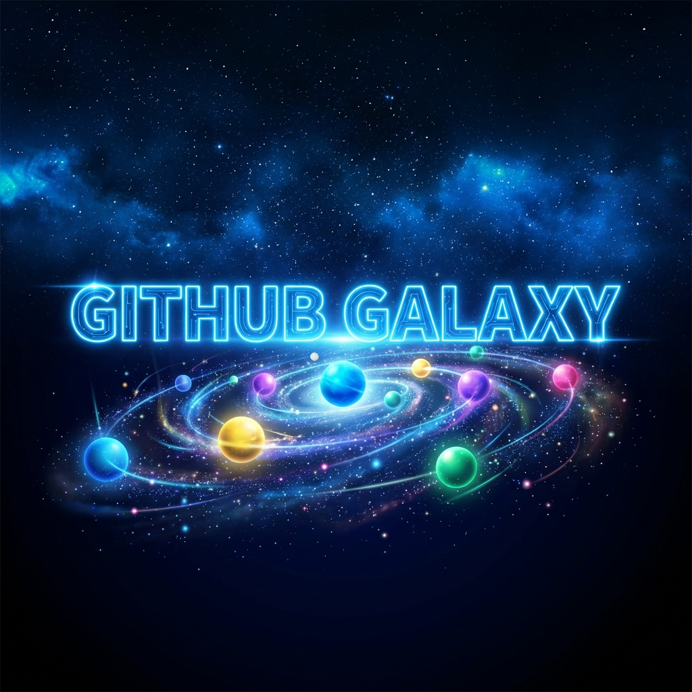
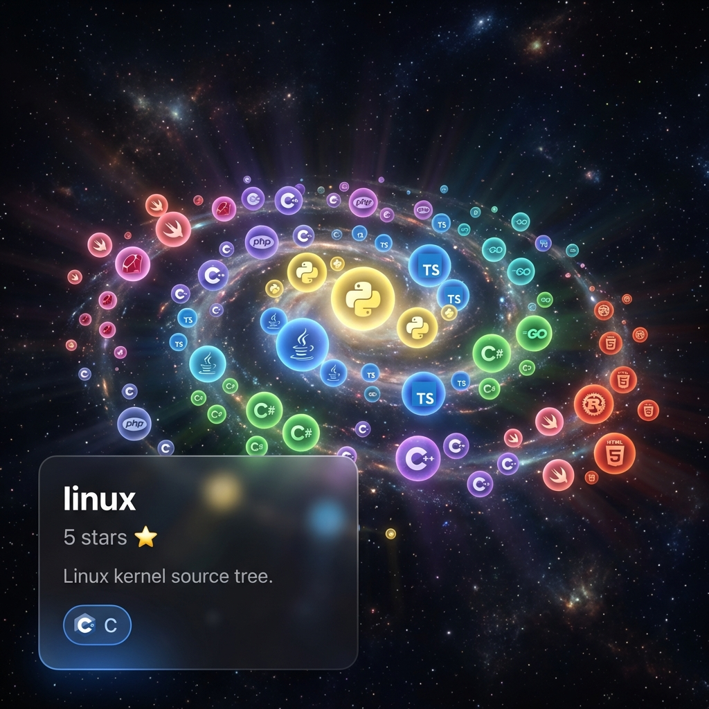

<div align="center">



# 🌌 GitHub Galaxy

**Explore the universe of code in stunning 3D**

[](https://reactjs.org/)
[](https://threejs.org/)
[](https://vitejs.dev/)
[](LICENSE)

[✨ Live Demo](#-quick-start) · [📖 Documentation](#-table-of-contents) · [🚀 Getting Started](#-installation)

</div>

---

## 🎯 What is GitHub Galaxy?

**GitHub Galaxy** transforms GitHub repositories into an **interactive 3D visualization** where each repository becomes a floating sphere in space. Explore any GitHub user's contributions through a beautiful, futuristic interface that makes data visualization feel like exploring the cosmos.

<div align="center">

### ✨ Key Features

| 🌟 **Smart Sizing** | 🎨 **Language Colors** | 🖱️ **Interactive 3D** |
|:---:|:---:|:---:|
| Sphere size scales with repository stars | Official GitHub language color scheme | Orbit, zoom, and explore freely |

</div>

---

## 🖼️ Screenshots

<div align="center">

### Search Interface

*Futuristic glassmorphism UI with neon accents*

### Galaxy Visualization

*Interactive 3D repository spheres with hover tooltips*

</div>

---

## 📋 Table of Contents

- [✨ Features](#-features)
- [🚀 Quick Start](#-quick-start)
- [📦 Installation](#-installation)
- [🎮 Usage](#-usage)
- [🏗️ Architecture](#️-architecture)
- [🎨 Design Philosophy](#-design-philosophy)
- [🛠️ Tech Stack](#️-tech-stack)
- [📊 Project Structure](#-project-structure)
- [🔧 Configuration](#-configuration)
- [🤝 Contributing](#-contributing)
- [📄 License](#-license)

---

## ✨ Features

### 🎯 Core Functionality

- **📡 GitHub API Integration**
  - Fetches all public repositories for any user
  - Automatic pagination for users with 100+ repos
  - Smart error handling for rate limits and invalid users

- **🌐 3D Visualization**
  - WebGL-powered rendering via React Three Fiber
  - Spiral galaxy distribution pattern
  - 5000 background stars for immersion
  - Smooth orbit controls with mouse/trackpad

- **🔮 Interactive Spheres**
  - **Size**: Logarithmic scaling based on stargazers count
  - **Color**: Official GitHub language colors (Python = blue, JavaScript = yellow, etc.)
  - **Animation**: Floating motion with sine wave physics
  - **Hover**: Emissive glow + detailed tooltip
  - **Click**: Opens repository URL in new tab

### 🎨 UI/UX Excellence

- **Futuristic Design**
  - Glassmorphism effects with backdrop blur
  - Neon gradient borders and glows
  - Smooth animations and transitions
  - Space-themed dark mode

- **Responsive Feedback**
  - Loading states with animated spinners
  - Error messages with helpful context
  - Welcome screen with feature highlights
  - Cursor changes for interactive elements

---

## 🚀 Quick Start

Get up and running in 3 commands:

```bash
# Clone the repository
git clone https://github.com/YOUR_USERNAME/github-galaxy.git
cd github-galaxy

# Install dependencies
npm install

# Start the development server
npm run dev
```

Open [http://localhost:5173](http://localhost:5173) in your browser and enter a GitHub username (try `torvalds`, `facebook`, or `microsoft`)! 🎉

---

## 📦 Installation

### Prerequisites

- **Node.js** 18.0 or higher
- **npm** 9.0 or higher (or **yarn**/**pnpm**)
- Modern browser with WebGL support

### Step-by-Step Setup

1. **Clone the repository**
   ```bash
   git clone https://github.com/YOUR_USERNAME/github-galaxy.git
   cd github-galaxy
   ```

2. **Install dependencies**
   ```bash
   npm install
   ```

3. **Run the development server**
   ```bash
   npm run dev
   ```

4. **Build for production**
   ```bash
   npm run build
   npm run preview  # Preview production build
   ```

---

## 🎮 Usage

### Basic Usage

1. **Launch the application** - Navigate to `http://localhost:5173`
2. **Enter a GitHub username** - Type any public GitHub username
3. **Click "🚀 Explore"** - Wait for the galaxy to load
4. **Interact with the visualization**:
   - 🖱️ **Drag** to rotate the camera
   - 📜 **Scroll** to zoom in/out
   - 👆 **Hover** over spheres to see repository details
   - 🎯 **Click** spheres to open the repository on GitHub

### Recommended Test Users

| Username | Description | Why Try It? |
|----------|-------------|-------------|
| `torvalds` | Linus Torvalds | Creator of Linux - diverse C projects |
| `facebook` | Facebook Org | Large-scale JavaScript/React ecosystem |
| `microsoft` | Microsoft Org | Wide language variety |
| `github` | GitHub Official | Mix of Ruby, Go, JavaScript |
| `vercel` | Vercel | Modern frontend projects |

### Tips for Best Experience

- 💡 **Large repos**: Users with many repos create stunning, dense galaxies
- 🎨 **Polyglot devs**: Developers using many languages create colorful visualizations
- ⭐ **Popular repos**: High star counts create impressive size variations

---

## 🏗️ Architecture

### Component Hierarchy

```
App.jsx
├── SearchBar.jsx          # Search input + error handling
└── Galaxy.jsx             # 3D Canvas container
    ├── <Canvas>           # R3F renderer
    ├── <Stars>            # Background starfield
    ├── <Lights>           # Scene lighting
    ├── <OrbitControls>    # Camera controls
    └── RepoSphere[]       # Individual repository spheres
        └── Tooltip.jsx    # HTML overlay tooltip
```

### Data Flow

```
User Input → GitHub API → Repository Data → 3D Scene → User Interaction
    ↓                                           ↓
SearchBar              →              Galaxy (Canvas)
                                           ↓
                                    RepoSphere (x N)
                                           ↓
                                    Tooltip Overlay
```

---

## 🎨 Design Philosophy

### Visual Identity

- **Space Theme**: Radial gradient backgrounds (deep blue → black)
- **Neon Accents**: Cyan (#64c8ff), Purple (#a864ff), Pink (#ff64c8)
- **Typography**: Inter font family for modern, clean aesthetics
- **Effects**: Glassmorphism, glow effects, smooth animations

### UX Principles

1. **Immediate Feedback**: Loading states, hover effects, visual confirmations
2. **Discoverability**: Clear instructions, intuitive interactions
3. **Performance**: Smooth 60 FPS rendering, optimized for large datasets
4. **Accessibility**: Semantic HTML, keyboard navigation support

---

## 🛠️ Tech Stack

### Core Technologies

| Technology | Purpose | Version |
|------------|---------|---------|
| **React** | UI framework | 19.2.0 |
| **Three.js** | 3D graphics library | 0.182.0 |
| **React Three Fiber** | React renderer for Three.js | 9.5.0 |
| **@react-three/drei** | Useful R3F helpers | 10.7.7 |
| **Vite** | Build tool & dev server | 7.2.4 |
| **github-colors** | Official language colors | 2.2.21 |

### Why This Stack?

- ✅ **React Three Fiber**: Declarative 3D with React's component model
- ✅ **Vite**: Lightning-fast HMR for rapid development
- ✅ **Three.js**: Industry-standard WebGL abstraction
- ✅ **Drei**: Battle-tested utilities (Stars, OrbitControls, etc.)

---

## 📊 Project Structure

```
github-galaxy/
├── .github/
│   └── assets/              # README images & banner
├── src/
│   ├── components/
│   │   ├── Galaxy.jsx       # Main 3D scene
│   │   ├── RepoSphere.jsx   # Individual sphere component
│   │   ├── SearchBar.jsx    # Search UI
│   │   ├── SearchBar.css    # Search styling
│   │   ├── Tooltip.jsx      # Hover tooltip
│   │   └── Tooltip.css      # Tooltip styling
│   ├── services/
│   │   └── githubApi.js     # GitHub API client
│   ├── utils/
│   │   └── languageColors.js # Color mapping
│   ├── App.jsx              # Root component
│   ├── App.css              # App styling
│   ├── index.css            # Global styles
│   └── main.jsx             # Entry point
├── index.html               # HTML template
├── package.json             # Dependencies
├── vite.config.js           # Vite configuration
└── README.md                # This file!
```

---

## 🔧 Configuration

### Environment Variables

GitHub Galaxy uses the **public GitHub API** by default (60 requests/hour). For higher rate limits:

1. Create a `.env` file:
   ```env
   VITE_GITHUB_TOKEN=your_github_personal_access_token
   ```

2. Update `src/services/githubApi.js`:
   ```javascript
   headers: {
     'Authorization': `token ${import.meta.env.VITE_GITHUB_TOKEN}`
   }
   ```

3. Restart the dev server

**Rate limits**:
- Unauthenticated: 60 requests/hour
- Authenticated: 5,000 requests/hour

### Customization

#### Adjust Sphere Size Scaling
Edit `src/components/RepoSphere.jsx`:
```javascript
const scaleFactor = Math.log10(repo.stargazers_count + 1) * 0.5;  // Adjust multiplier
```

#### Modify Galaxy Distribution
Edit `src/components/Galaxy.jsx`:
```javascript
const angle = (index / totalRepos) * Math.PI * 4;  // Change rotation count
const radius = 5 + (index / totalRepos) * 15;      // Adjust spread
```

#### Change Color Theme
Edit `src/index.css`:
```css
:root {
  --accent-blue: #64c8ff;    /* Primary accent */
  --accent-purple: #a864ff;  /* Secondary accent */
  --accent-pink: #ff64c8;    /* Tertiary accent */
}
```

---

## 🤝 Contributing

Contributions are welcome! Here's how to get started:

### Development Workflow

1. **Fork the repository**
2. **Create a feature branch**
   ```bash
   git checkout -b feature/amazing-feature
   ```
3. **Make your changes** and commit
   ```bash
   git commit -m "Add amazing feature"
   ```
4. **Push to your fork**
   ```bash
   git push origin feature/amazing-feature
   ```
5. **Open a Pull Request**

### Code Style

- Use ESLint for code quality
- Follow React best practices
- Write descriptive commit messages
- Add comments for complex logic

### Ideas for Contributions

- 🎨 Theme switcher (light/dark mode)
- 🔍 Advanced filtering (by language, stars, date)
- 📱 Mobile touch controls
- 📊 Repository statistics panel
- 🎥 Export galaxy as image/video
- 🌐 i18n support

---

## 📄 License

This project is licensed under the **MIT License** - see the [LICENSE](LICENSE) file for details.

---

## 🙏 Acknowledgments

- **GitHub API** for providing free access to repository data
- **Three.js** community for excellent documentation
- **React Three Fiber** team for bridging React and 3D
- **github-colors** package for official language colors

---

<div align="center">

### 💫 Star this repo if you found it helpful!

**Built with ❤️ by [Your Name]**

[⬆ Back to Top](#-github-galaxy)

</div>
